### 👋 Hello! I'm Brinsley Morrison.

My background is a bit of a mix. I'm a classically trained musician and composer who has a passion for learning languages: I'm currently learning **Mandarin Chinese**, **Japanese** and **Korean**, but am also **fascinated by musical language**, creating paletes of different musical expression, as well as **computer languages** & **web development**.

### 🎻 Music & Composition

I hold a First Class Honours BA in Music from the **University of York**, where I specialized in Composition for Film, and I'm an alumnus of the prestigious **Chetham’s School of Music**. I've had the privilege of playing as a principal violinist in multiple orchestras and have a rich history in classical and choral performance. This has given me a unique perspective on creativity, discipline, and collaborative work.

### 💻 Web Development

When I'm not making music, I'm creating learning more about web development. I enjoy creating fast, visually sleak, and useful tools such as my , or .

* **Currently Building With:** Next.js, Hugo, React, and TypeScript.
* **Interests:** Full-stack development, serverless architecture, UI/UX design, Self-hosted & Open-Source software, data privacy.
* **Portfolio:** You can see some of my work at [brinsleymorrison.com](https://brinsleymorrison.com).

    
    

### 🌏 Language Learning

In my spare time, I'm an avid language learner, and always curious about learning about different cultures and ways of thinking.

**Currently Studying:**
* Chinese (Mandarin): for 2.5 years,
* Japanese: for 4 years,
* Korean: for 6 months.

### 📊 My GitHub Metrics

  
  
  

